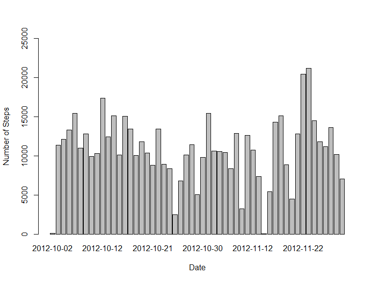
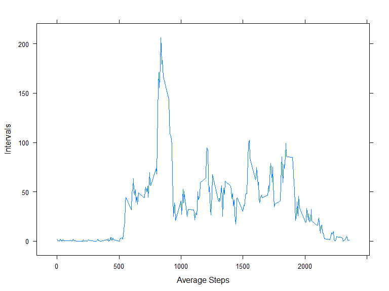
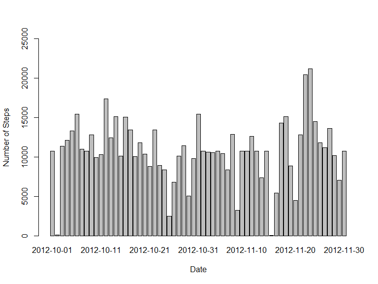
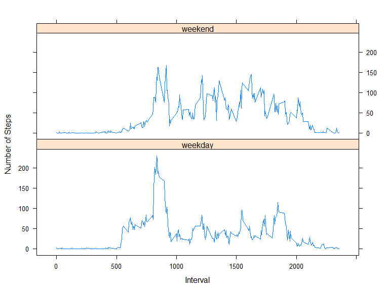

# Reproducible Research: Peer Assessment 1
###Loading Packages

```r
library(dplyr)
library(lattice)
require(knitr)
```

###Setting Global Environment

```r
opts_chunk$set(echo = TRUE, fig.path = "figure/")
```


###Loading and preprocessing the data

```r
if (!file.exists("activity.csv")) {
  unzip("activity.zip")
}

Data.Raw <- read.csv(file="activity.csv",
                     colClasses = c("numeric","character","numeric"),
                     header=TRUE,sep=",")
```

# What is mean total number of steps taken per day?

#### 1. Total steps taken each day

```r
Data.Base <- na.omit(Data.Raw)
Data.TotalStepsPerDay <- Data.Base %>% 
  group_by(date) %>%
  select(date, steps) %>%
  summarise(totalsteps = sum(as.numeric(steps)))

head(Data.TotalStepsPerDay)
```

```
## Source: local data frame [6 x 2]
## 
##         date totalsteps
## 1 2012-10-02        126
## 2 2012-10-03      11352
## 3 2012-10-04      12116
## 4 2012-10-05      13294
## 5 2012-10-06      15420
## 6 2012-10-07      11015
```

#### 2. Histogram of total number steps taken per day

```r
barplot(Data.TotalStepsPerDay$totalsteps, names.arg=Data.TotalStepsPerDay$date, ylim=c(0, 25000), 
        xlab="Date", ylab="Number of Steps")
```

 

#### 3. Mean of total number of steps taken per day

```r
mean(Data.TotalStepsPerDay$totalsteps)
```

```
## [1] 10766.19
```

#### 4. Median of total number of steps taken per day

```r
median(Data.TotalStepsPerDay$totalsteps)
```

```
## [1] 10765
```


## What is the average daily activity pattern?

#### 1. Time series plot of the 5-minute interval and the average number of steps taken across all days 

```r
Data.AvgStepsPerInterval <- Data.Base %>% 
  group_by(interval) %>%
  select(interval, steps) %>%
  summarise(avgsteps = mean(as.numeric(steps)))

xyplot(avgsteps~interval, Data.AvgStepsPerInterval, type="l", xlab = "Average Steps", ylab ="Intervals")
```

 

#### 2. 5-minute interval, on average across all the days in the dataset, with maximum number of steps

```r
Data.AvgStepsPerInterval$interval[which.max(Data.AvgStepsPerInterval$avgsteps)]
```

```
## [1] 835
```

## Imputing missing values

#### 1. Total number of missing values in the dataset

```r
sum(is.na(Data.Raw$steps))
```

```
## [1] 2304
```

#### 2. Strategy for filling in all of the missing values in the dataset
The missing values will be replaced with the mean for corresponding 5-minute interval

#### 3. New dataset that is equal to the original dataset but with the missing data filled in

```r
Data.NAFilled <- Data.Raw
for(i in 1:nrow(Data.NAFilled))
{
  record = Data.NAFilled[i, ]
  if(is.na(record$steps))
  {
    Data.NAFilled[i, ]$steps <- filter(Data.AvgStepsPerInterval, interval == record$interval)$avgsteps
  }
}
```


```r
Data.NAFilled.TotalStepsPerDay <- Data.NAFilled %>% 
  group_by(date) %>%
  select(date, steps) %>%
  summarise(totalsteps = sum(as.numeric(steps)))

head(Data.NAFilled.TotalStepsPerDay)
```

```
## Source: local data frame [6 x 2]
## 
##         date totalsteps
## 1 2012-10-01   10766.19
## 2 2012-10-02     126.00
## 3 2012-10-03   11352.00
## 4 2012-10-04   12116.00
## 5 2012-10-05   13294.00
## 6 2012-10-06   15420.00
```

#### 4. Histogram of total number steps taken per day

```r
barplot(Data.NAFilled.TotalStepsPerDay$totalsteps, names.arg=Data.NAFilled.TotalStepsPerDay$date, ylim=c(0, 25000), xlab="Date", ylab="Number of Steps")
```

 

#### 5. Mean of total number of steps taken per day

```r
mean(Data.NAFilled.TotalStepsPerDay$totalsteps)
```

```
## [1] 10766.19
```

#### 6. Median of total number of steps taken per day

```r
median(Data.NAFilled.TotalStepsPerDay$totalsteps)
```

```
## [1] 10766.19
```

#### 7. Do these values differ from the estimates from the first part of the assignment? What is the impact of imputing missing data on the estimates of the total daily number of steps?
The mean has remained the same but the median has a little increase

## Are there differences in activity patterns between weekdays and weekends?

#### 1. A new factor variable in the dataset with two levels -- "weekday" and "weekend"

```r
getDay <- function(date) {
    ifelse ((weekdays(date) %in% c("Saturday", "Sunday")), "weekend", "weekday")
  }

Data.NAFilled <- dplyr::mutate(Data.NAFilled, dayType = getDay(as.Date(date)))
Data.NAFilled$dayType <- factor(Data.NAFilled$dayType, levels = unique(Data.NAFilled$dayType))
str(Data.NAFilled)
```

```
## 'data.frame':	17568 obs. of  4 variables:
##  $ steps   : num  1.717 0.3396 0.1321 0.1509 0.0755 ...
##  $ date    : chr  "2012-10-01" "2012-10-01" "2012-10-01" "2012-10-01" ...
##  $ interval: num  0 5 10 15 20 25 30 35 40 45 ...
##  $ dayType : Factor w/ 2 levels "weekday","weekend": 1 1 1 1 1 1 1 1 1 1 ...
```

#### 2. Panel plot containing a time series plot (i.e. `type = "l"`) of the 5-minute interval (x-axis) and the average number of steps taken, averaged across all weekday days or weekend days (y-axis)


```r
Data.NAFilled.StepsPerInterval <- Data.NAFilled %>% 
  group_by(interval, dayType) %>%
  select(interval, dayType, steps) %>%
  summarise(avgsteps = mean(as.numeric(steps)))

xyplot(avgsteps~interval|dayType, Data.NAFilled.StepsPerInterval, type="l", xlab = "Interval", ylab = "Number of Steps", layout = c(1, 2))
```

 
